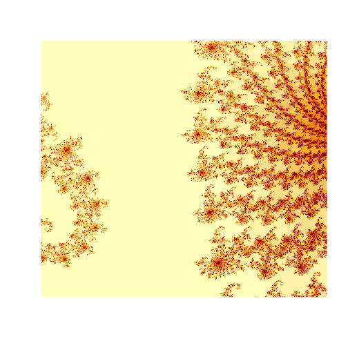
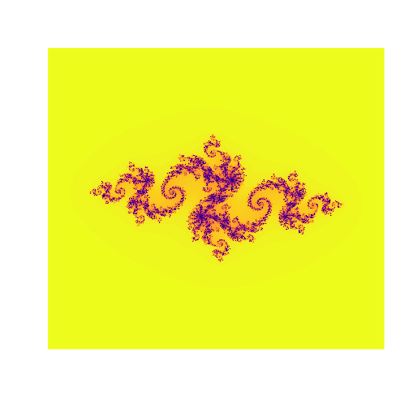

<!-- README.md is generated from README.Rmd. Please edit that file -->


# Fractals in R

<!-- badges: start -->
  [](https://travis-ci.com/kkholst/fractalr)
  [](https://opensource.org/licenses/Apache-2.0)
<!-- badges: end -->


## Installation


```r
remotes::install_github("kkholst/fractalr")
```

## Examples

To start the user interface:

```r
fraftalr::ui()
```
This wiil bring up a browser window with the shiny application.


```r
res <- fractalr:::.mandelbrot(cx=-0.7367, cy=0.1692, R=0.001, maxIter=500)
image(res, useRaster=TRUE, axes=FALSE)
```




```r
res <- fractalr:::.julia(cx=0, cy=0, R=2, c=complex(1,-.79,0.15))
image(res, useRaster=TRUE, axes=FALSE, col=viridis::plasma(128, direction=-1))
```


